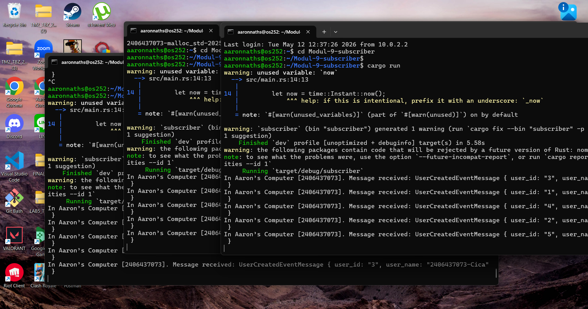
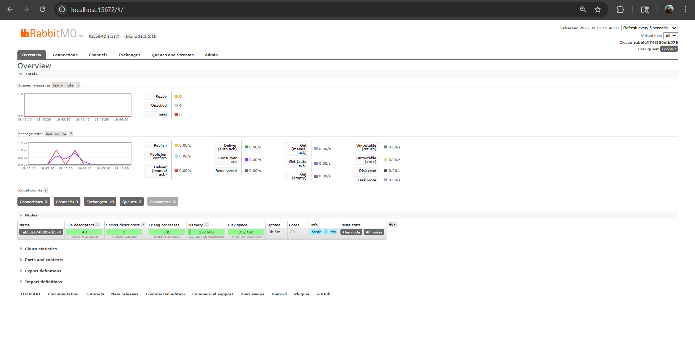

a. What is amqp?
AMQP adalah singkatan dari Advanced Message Queuing Protocol. Secara sederhana, ini adalah sebuah protokol standar yang digunakan untuk pengiriman pesan antar sistem atau aplikasi. Dalam tugas ini, AMQP berfungsi sebagai bahasa komunikasi yang memungkinkan aplikasi kita (publisher dan subscriber) untuk saling mengirim dan menerima event melalui perantara message broker (RabbitMQ) dengan aman dan terstruktur.

b. What does it mean? guest:guest@localhost:5672 , what is the first guest, and what
is the second guest, and what is localhost:5672 is for?
URL tersebut adalah jalur koneksi (connection string) yang digunakan oleh program Rust kita untuk bisa masuk dan terhubung ke server RabbitMQ. Berikut adalah rinciannya:

- guest yang pertama adalah username bawaan (default) dari RabbitMQ.

- guest yang kedua adalah password bawaan (default) dari RabbitMQ.

- localhost:5672 menunjukkan lokasi server beroperasi. localhost artinya RabbitMQ tersebut sedang berjalan di komputer lokal kita sendiri (lewat Docker), sedangkan 5672 adalah port standar yang dibuka oleh RabbitMQ khusus untuk menerima koneksi dari protokol AMQP.

### Simulating Slow Subscriber

**Penjelasan:**
Pada grafik *Queued messages* di atas, terlihat ada *spike* (lonjakan) pada garis merah. Lonjakan ini terjadi karena program *publisher* dijalankan beberapa kali secara cepat berturut-turut, sehingga pesan sempat menumpuk di dalam antrean (*queue*).

Pada percobaan yang saya lakukan, jumlah antrean pesan memuncak di angka 10. Hal ini disebabkan oleh kecepatan *publisher* dalam mempublikasikan *event* ke RabbitMQ yang jauh melebihi kecepatan *subscriber* dalam memprosesnya (karena adanya simulasi *delay* sistem pada *subscriber*).

Seiring berjalannya waktu, *subscriber* terus memproses pesan tersebut satu per satu dan mengirimkan *acknowledgement* kembali ke *broker*. Hasilnya, grafik jumlah antrean perlahan-lahan menurun miring hingga kembali ke angka 0, yang menandakan bahwa seluruh pesan yang sempat *bottleneck* tersebut sudah berhasil dikonsumsi dengan tuntas.

### Reflection and Running at least three subscribers

**Refleksi & Penjelasan:**
Pada percobaan ini, saya menjalankan 3 *subscriber* secara bersamaan di tiga konsol berbeda. Hal ini terbukti dari *dashboard* RabbitMQ yang menunjukkan angka 3 pada metrik **Connections, Channels, dan Consumers**.

Setelah itu, saya menjalankan program *publisher* beberapa kali secara cepat. Namun, pada grafik *Queued messages* hampir tidak terlihat adanya antrean yang menumpuk panjang. Pesan langsung habis diproses dan garisnya dengan sangat cepat kembali ke 0 (hanya terlihat aktivitas pada grafik *Message rates*).

**Kenapa hal ini bisa terjadi?**
Ini merupakan bukti nyata kehebatan dari *Event-Driven Architecture*. Karena kita memiliki 3 *subscriber* yang aktif terhubung ke *queue* yang sama, RabbitMQ mendistribusikan beban kerja (*message*) kepada ketiga *consumer* tersebut secara merata (paralel). Hasilnya, proses konsumsi pesan menjadi 3 kali lebih cepat dan antrean tidak sempat menumpuk lama.

**Kesimpulan:**
Konsep ini membuktikan bahwa arsitektur ini sangat *scalable*. Jika suatu saat *demand* atau jumlah *event* yang masuk melonjak drastis, kita hanya perlu *spawn* (menambah) jumlah *subscriber* untuk mempercepat pemrosesan tanpa harus mengubah logika program utamanya.

